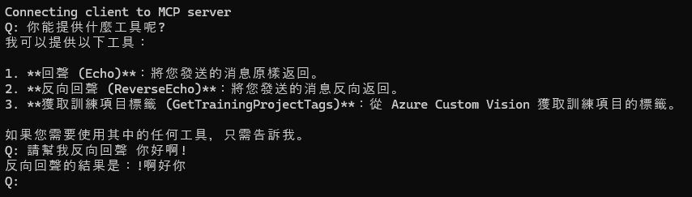

# McpClientServerExample

McpClientServerExample 是一個基於 Model Context Protocol (MCP) 的範例專案，展示了如何實現客戶端與伺服器之間的通訊。此專案包含兩個主要部分：`McpClient` 和 `McpServer`，分別代表客戶端與伺服器。

用自製的Client，以不使用Claude Client App 為範例

## 功能

### 客戶端 (`McpClient`)
- 使用 `ModelContextProtocol.Client` 與伺服器通訊。
- 支援 OpenAI GPT 模型進行對話。
- 提供工具列表並支援工具函數調用。

### 伺服器 (`McpServer`)
- 使用 `ModelContextProtocol.Server` 提供 MCP 伺服器功能。
- 支援標準輸入/輸出通訊。
- 提供內建工具，例如：
  - `Echo`: 回傳用戶輸入的訊息。
  - `ReverseEcho`: 回傳用戶輸入訊息的反轉版本。

## 安裝與執行

### 需求
- [.NET 8.0 SDK](https://dotnet.microsoft.com/download/dotnet/8.0)
- OpenAI API 金鑰（若使用 GPT 模型）

```bash
export OPENAI_API_KEY=your_api_key_here
```
### 執行

```bash
dotnet run --project client/McpClient.csproj
```

### 使用範例

